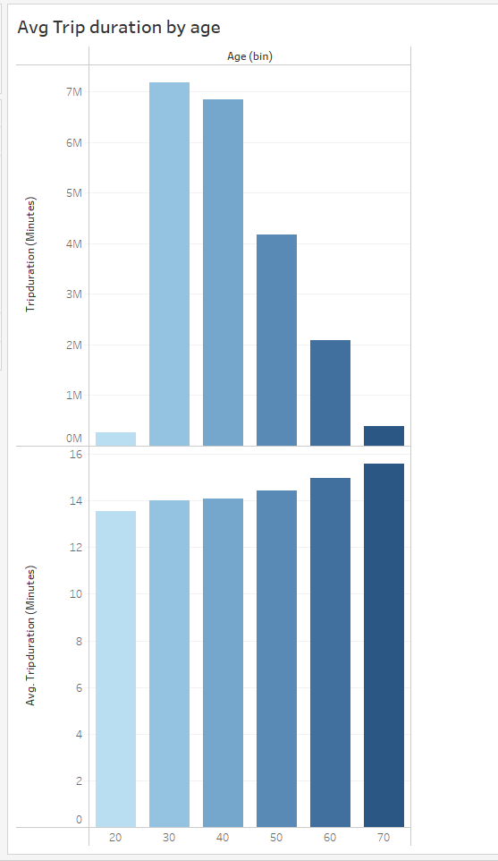

# Tableau
City bike analysis

## Overview of Project

Aggregate the data found in the Citi Bike Trip History Logs and find two unexpected phenomena

### Purpose

## Analysis and Challenges

Although I intended to upload all csv files inyo Tableau by a union, I was getting a lot of errors so I opted for uploading only two files and not mention any time trends.

### Analysis of Outcomes of the most relevant Tableau reports

* _Gender weight_

    76 % of riders are male vs 24 % female      

* _Trip Duration_

    Riders between 20 and 50 years old ride bikes more frequently. However, that doesn't mean the older generation ride less time. The second chart shows that older generation 70 and older tend to enjoy even longer rides.

* _Peak hours_

    Bike users tend to ride these bikes eaither early morning or later in the evening. We assume bikes are rented because these are the hours before before and after work

* _Top 10 stations_

Location wise the most popular stations seem to be scaterred. We can't find any correlation

### Links

[main_dashbord_report](https://public.tableau.com/app/profile/enrique2630/viz/Citybike_16214719117930/Story)

[Citi Bike Data](https://www.citibikenyc.com/system-data)

